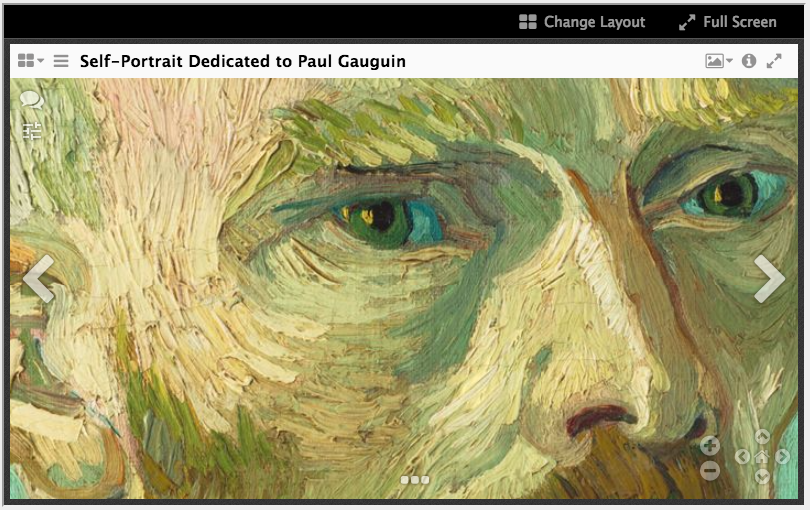
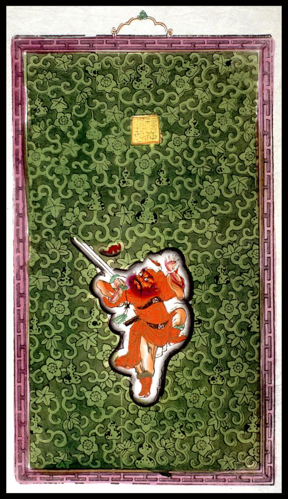
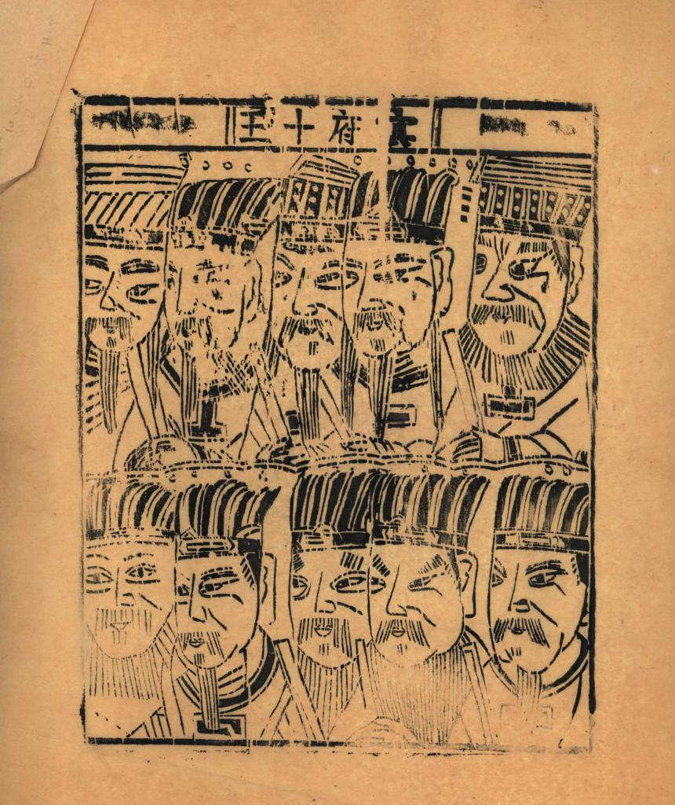

Above: Screenshot of a IIIF canvas in Mirador Viewer. [<a href="http://projectmirador.org/demo/">source</a>]
 

### Objective 1: Create a set of proof-of-concept Jekyll sites that showcase the extent of what the static site generator can do (i.e. without complex server scripts or databases!) and push those limits.

### Objective 2: Apply lessons from the these sites in prototyping an Omeka-like, modular, minimal computing multitool  using Jekyll for digital exhibitions, journals, and blogs, complete with a menu of components ranging from lazy-loading carousels to IIIF manuscript manifests, dynamic client-side search to data visualizations.
 

 

## v0.1 / codename: [paper gods]()

__what it is:__ digital (image) collection demo site

__achievements unlocked:__ [IIIF single images](), [IIIF manifest](), tile generation from local images, [client-side search](), discrete jekyll collections

__tools:__ [jekyll-iiif plugin](https://github.com/pbinkley/jekyll-iiif), [iiif_s3](https://github.com/cmoa/iiif_s3),[lunrjs](https://github.com/olivernn/lunr.js), [mirador](https://github.com/ProjectMirador/mirador), [openseadragon](https://github.com/openseadragon/openseadragon)

__sage advice from:__ [peter binkley](https://pbinkley.github.io/jekyll-iiif/), [katy decorah](http://katydecorah.com/code/lunr-and-jekyll/), [ray hightower](http://rayhightower.com/blog/2016/01/04/how-to-make-lunrjs-jekyll-work-together/)

__repo:__ [/papergods_site]()

<table>
  <tr>
    <td style="padding:20px">
      <a href="https://dlc.library.columbia.edu/catalog/ldpd:114041">  
      
<i><b>Fu zai yan qian</b></i> Chinese Paper Gods @ Columbia University DLC
</a>
    </td>
    <td style="padding:20px">
      <a href="https://dlc.library.columbia.edu/catalog/ldpd:114222">  
      
<i><b>Min fu shi wang</b></i> Chinese Paper Gods @ Columbia University DLC
</a>
    </td>
  </tr>
</table>

 

 

## v0.2 / codename: [butler '75](https://mnyrop.github.io/historical-photos)

__what it is:__ digital (image) collection demo site

__achievements unlocked:__ [single IIIF images](https://mnyrop.github.io/historical-photos/photos/butler-library-painted-red) from remote links ([CUL DLC](https://dlc.library.columbia.edu/catalog/cul:tx95x69pph)), auto-generation of Jekyll collection pages from data file, [masonry gallery](https://mnyrop.github.io/historical-photos/photos/index.html), [data visualization powered by Jekyll data](https://mnyrop.github.io/historical-photos/namegraph)

__tools:__ [yaml-splitter](https://github.com/mnyrop/yaml-splitter), [d3js](https://d3js.org/), [masonry](https://unpkg.com/masonry-layout@4.2.0)

__repo:__ [/historical-photos](https://github.com/mnyrop/historical-photos)

__blog post:__ [autogenerate-json-for-d3]({{ site.url }}/notes/autogenerate-json-for-d3-from-jekyll-collection-data)

 

 

 

## v0.3 / codename: [bunraku](https://mnyrop.github.io/bunraku-demo)

__what it is:__ (soon-to-be) production-ready digital collection site of images, albums, and relational cultural data

__achievements unlocked:__ [deeply relational collections](), [client-side advanced category search](), [client-side multi-language search](), [lazy-load image carousel](), [advanced data visualizations]()

__tools:__ [yaml-splitter](), [ipython](), [pandas](), [jq](), [owl carousel](), [d3js](), [lunrjs](), [lunr-languages]()

__repos:__ [/bunraku-demo](https://github.com/mnyrop/bunraku-demo), [/bunraku-ipy](https://github.com/mnyrop/bunraku-ipy), [/bunraku-jekyll](https://github.com/mnyrop/bunraku-jekyll)

__blog series:__ [the summer of puppets]({{ site.url }}/notes/the-summer-of-puppets)

 

<iframe width="100%" height="700" src="//jsfiddle.net/marii_/zkdzy0qq/2/embedded/result,js/" allowfullscreen="allowfullscreen" frameborder="0" style="box-shadow: 2px 2px 4pc #23352a;"></iframe>

 

 
